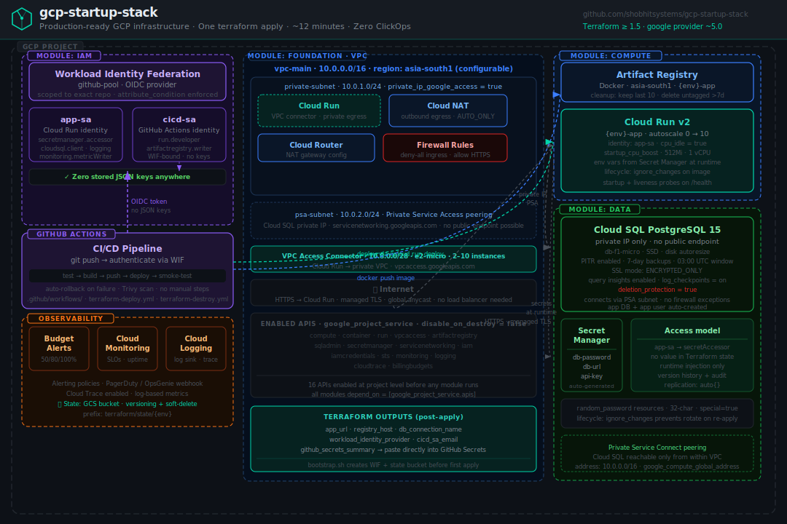

# gcp-startup-stack

> Production-ready GCP infrastructure for startups — one `terraform apply`, ~12 minutes, zero ClickOps.

[](https://github.com/shobhitsystems/gcp-startup-stack/actions/workflows/validate.yml)
[](https://developer.hashicorp.com/terraform)
[](https://registry.terraform.io/providers/hashicorp/google/latest)
[](LICENSE)

A complete, opinionated GCP foundation for seed-to-Series-A startups. Everything your team needs to run production traffic — private networking, Cloud Run, Cloud SQL, Secret Manager, Workload Identity Federation, and full observability — deployed from a single command.

Every resource is defined in Terraform. No console clicks. No ClickOps debt. Your team owns all the code after handover.

---

## Architecture



---

## What gets deployed

| Module | Resources | Time |
|---|---|---|
| **foundation** | VPC · private subnet · PSA subnet · Cloud NAT · Cloud Router · VPC connector · firewall rules | ~3 min |
| **iam** | app-sa · cicd-sa · WIF pool · GitHub OIDC provider · IAM bindings | ~1 min |
| **data** | Cloud SQL PostgreSQL 15 (private IP) · 3 × Secret Manager secrets | ~5 min |
| **compute** | Artifact Registry (Docker) · Cloud Run v2 service | ~2 min |
| **cicd** | GitHub Actions trigger · Cloud Build managed SA bindings | ~1 min |
| **root** | 16 project APIs · billing budget alerts (50/80/100%) | ~1 min |

**Total: ~12 minutes. 24+ resources. Zero manual steps after bootstrap.**

---

## Security by default

Every resource is configured to production security standards out of the box:

- **No public Cloud SQL endpoint** — database accessible only via Private Service Connect from within the VPC
- **No stored JSON keys** — GitHub Actions authenticates to GCP using Workload Identity Federation (short-lived OIDC tokens)
- **No plaintext secrets** — all credentials stored in Secret Manager, injected at runtime. No values in Terraform state
- **No public Cloud Storage** — uniform bucket-level access + public access prevention enforced
- **Least-privilege IAM** — `app-sa` and `cicd-sa` granted only the exact roles they need, via `for_each` over a role list
- **WIF scoped to exact repo** — `attribute_condition` prevents any other GitHub repo from impersonating your service accounts
- **`prevent_destroy` on WIF pool** — accidental `terraform destroy` cannot revoke CI/CD access
- **`deletion_protection = true` on Cloud SQL** — database cannot be destroyed without explicit override

---

## Prerequisites

| Tool | Version | Install |
|---|---|---|
| Terraform | ≥ 1.5 | [developer.hashicorp.com/terraform/install](https://developer.hashicorp.com/terraform/install) |
| gcloud CLI | latest | [cloud.google.com/sdk/docs/install](https://cloud.google.com/sdk/docs/install) |
| A GCP project | — | With billing enabled |
| A GitHub repository | — | Where your application code lives |

---

## Bootstrap (one-time, ~5 minutes)

Run this once before anything else. It creates the state bucket, WIF pool, and `cicd-sa` that GitHub Actions needs to run `terraform apply`.

```bash
chmod +x scripts/bootstrap.sh

# With a GCP Organisation:
./scripts/bootstrap.sh YOUR_PROJECT_ID BILLING_ACCOUNT shobhitsystems gcp-startup-stack ORG_ID

# Without a GCP Organisation (personal/standalone project):
./scripts/bootstrap.sh YOUR_PROJECT_ID BILLING_ACCOUNT shobhitsystems gcp-startup-stack existing
```

The script prints the exact values to add as GitHub Secrets at the end.

---

## Quick start

```bash
# 1. Clone
git clone https://github.com/shobhitsystems/gcp-startup-stack.git
cd gcp-startup-stack

# 2. Authenticate locally
gcloud auth application-default login
gcloud config set project YOUR_PROJECT_ID

# 3. Fill in variables
cp terraform.tfvars.example terraform.tfvars
# Edit terraform.tfvars — only project_id, github_org, github_repo are required

# 4. Initialise with remote state
terraform init \
  -backend-config="bucket=YOUR_PROJECT_ID-tfstate" \
  -backend-config="prefix=terraform/state/demo"

# 5. Review the plan
terraform plan

# 6. Deploy
terraform apply
```

Total time: **~12 minutes**. When `apply` completes, the outputs section shows your live app URL.

---

## Configuration

Copy `terraform.tfvars.example` to `terraform.tfvars` and fill in your values.

### Required

| Variable | Description |
|---|---|
| `project_id` | Your GCP project ID |
| `github_org` | GitHub organisation or personal username |
| `github_repo` | Repository name (no org prefix) |

### Optional

| Variable | Default | Description |
|---|---|---|
| `region` | `asia-south1` | GCP region for all resources |
| `env` | `demo` | Environment prefix on all resource names |
| `billing_account_id` | `""` | Billing account for budget alerts. Leave empty to skip |
| `monthly_budget_usd` | `500` | Monthly spend threshold — alerts at 50%, 80%, 100% |

### Region options

| Value | Location |
|---|---|
| `asia-south1` | Mumbai — lowest latency for India |
| `asia-southeast1` | Singapore |
| `us-central1` | Iowa |
| `us-east4` | Northern Virginia |
| `europe-west2` | London |
| `europe-west3` | Frankfurt |

---

## Module reference

### `modules/foundation`

Creates the full network layer. Nothing else runs until this is complete.

```
vpc-main (10.0.0.0/16)
├── private-subnet     10.0.1.0/24   private_ip_google_access = true
├── psa-subnet         10.0.2.0/24   Cloud SQL private service access
├── Cloud NAT                         outbound egress for private resources
├── Cloud Router                      NAT gateway config
├── Firewall rules                    deny-all ingress · allow HTTPS · allow health checks
└── VPC Access Connector              10.8.0.0/28 · connects Cloud Run to VPC
```

### `modules/iam`

Creates all identities and the keyless authentication chain.

```
app-sa
├── roles/secretmanager.secretAccessor
├── roles/cloudsql.client
├── roles/cloudtrace.agent
├── roles/logging.logWriter
├── roles/monitoring.metricWriter
└── roles/artifactregistry.reader

cicd-sa
├── roles/run.developer
├── roles/artifactregistry.writer
├── roles/secretmanager.secretAccessor
├── roles/logging.logWriter
├── roles/storage.objectAdmin
└── roles/iam.serviceAccountUser

WIF pool (github-pool)
└── OIDC provider (github-oidc)
    ├── issuer: token.actions.githubusercontent.com
    ├── attribute_condition: scoped to exact repo
    └── binding: repo → cicd-sa impersonation
```

### `modules/data`

Creates the database and all secrets. No values appear in Terraform state.

```
Cloud SQL PostgreSQL 15
├── Private IP only (no public endpoint)
├── PSA peering via psa-subnet
├── PITR enabled
├── Automated daily backups (7-day retention)
├── SSL mode: ENCRYPTED_ONLY
├── deletion_protection = true
└── Query insights enabled

Secret Manager
├── {env}-db-password   auto-generated 32-char password
├── {env}-db-url        full PostgreSQL connection string
└── {env}-api-key       auto-generated 40-char token
    └── app-sa granted secretAccessor on all three
```

### `modules/compute`

Creates the container registry and the Cloud Run service.

```
Artifact Registry
├── Format: Docker
├── Location: {region}
└── Cleanup: keep last 10 tags · delete untagged after 7 days

Cloud Run v2
├── Identity: app-sa
├── VPC egress via connector (private ranges only)
├── Autoscaling: 0 → 10 instances
├── Resources: 1 vCPU · 512 MiB
├── cpu_idle = true · startup_cpu_boost = true
├── Env vars injected from Secret Manager at runtime
├── Startup probe + liveness probe on /health
└── lifecycle.ignore_changes on image (CI/CD owns this)
```

### `modules/cicd`

Creates the GitHub Actions trigger and grants Cloud Build managed SA the roles it needs.

```
GitHub Actions trigger
├── Fires on push to main (configurable)
├── Service account: cicd-sa
├── Substitutions: PROJECT_ID · REGION · ENV · REGISTRY_HOST · SERVICE_NAME
└── Included files: application code only (not .tf, not .md)

Cloud Build managed SA grants
├── roles/logging.logWriter
└── roles/storage.objectViewer
```

---

## Outputs

After `terraform apply` completes:

```
app_url                    = "https://demo-app-xxxx.run.app"
registry_host              = "asia-south1-docker.pkg.dev/your-project/demo-app"
registry_path              = "asia-south1-docker.pkg.dev/your-project/demo-app/app"
db_instance_name           = "demo-postgres"
db_connection_name         = "your-project:asia-south1:demo-postgres"
workload_identity_provider = "projects/123/locations/global/..."
deployer_sa_email          = "demo-cicd-sa@your-project.iam.gserviceaccount.com"
app_sa_email               = "demo-app-sa@your-project.iam.gserviceaccount.com"

github_secrets_summary = {
  GCP_WORKLOAD_IDENTITY_PROVIDER = "projects/123/..."
  GCP_SERVICE_ACCOUNT            = "demo-cicd-sa@..."
  GCP_PROJECT_ID                 = "your-project"
  GCP_REGION                     = "asia-south1"
}
```

Add the four values in `github_secrets_summary` to your GitHub repository:
**Settings → Secrets and variables → Actions → New repository secret**

---

## GitHub Actions CI/CD

After adding the four secrets, your application repository can use this workflow to build and deploy automatically:

```yaml
name: Deploy

on:
  push:
    branches: [main]

permissions:
  contents: read
  id-token: write   # required for WIF

jobs:
  deploy:
    runs-on: ubuntu-latest
    steps:
      - uses: actions/checkout@v4

      - name: Authenticate to GCP
        uses: google-github-actions/auth@v2
        with:
          workload_identity_provider: ${{ secrets.GCP_WORKLOAD_IDENTITY_PROVIDER }}
          service_account: ${{ secrets.GCP_SERVICE_ACCOUNT }}

      - name: Build and push image
        run: |
          gcloud auth configure-docker ${{ secrets.GCP_REGION }}-docker.pkg.dev --quiet
          docker build -t ${{ secrets.GCP_REGION }}-docker.pkg.dev/${{ secrets.GCP_PROJECT_ID }}/demo-app/app:${{ github.sha }} .
          docker push ${{ secrets.GCP_REGION }}-docker.pkg.dev/${{ secrets.GCP_PROJECT_ID }}/demo-app/app:${{ github.sha }}

      - name: Deploy to Cloud Run
        run: |
          gcloud run deploy demo-app \
            --image=${{ secrets.GCP_REGION }}-docker.pkg.dev/${{ secrets.GCP_PROJECT_ID }}/demo-app/app:${{ github.sha }} \
            --region=${{ secrets.GCP_REGION }} \
            --project=${{ secrets.GCP_PROJECT_ID }} \
            --platform=managed \
            --quiet
```

No `GOOGLE_CREDENTIALS` secret. No JSON key. Keyless authentication via Workload Identity Federation.

---

## Destroy

```bash
# Remove deletion_protection on Cloud SQL first
# In terraform.tfvars, add: # (or override in modules/data/main.tf)
# Then:
terraform destroy
```

> **Note:** The GCS state bucket and WIF pool created by `bootstrap.sh` are not managed by Terraform. Delete them manually if you no longer need them:
> ```bash
> gcloud storage rm -r gs://YOUR_PROJECT_ID-tfstate/terraform/state/demo/
> gcloud iam workload-identity-pools delete terraform-pool \
>   --project=YOUR_PROJECT_ID --location=global
> ```

---

## Repository structure

```
gcp-startup-stack/
├── main.tf                    Root: module wiring, API enablement, billing budget
├── variables.tf               All input variables with descriptions
├── outputs.tf                 Key outputs including github_secrets_summary
├── terraform.tfvars.example   Copy to terraform.tfvars — fill in 3 required values
├── backend.hcl                Backend config template (pass via -backend-config)
├── modules/
│   ├── foundation/            VPC, subnets, NAT, firewall, VPC connector
│   ├── iam/                   Service accounts, WIF pool, IAM bindings
│   ├── data/                  Cloud SQL, Secret Manager secrets
│   ├── compute/               Artifact Registry, Cloud Run
│   └── cicd/                  GitHub Actions trigger, Cloud Build SA bindings
├── scripts/
│   └── bootstrap.sh           One-time setup: state bucket + WIF + cicd-sa
└── .github/
    └── workflows/
        ├── validate.yml       fmt check + terraform validate (no credentials needed)
        ├── terraform-deploy.yml   Plan + manual approval + apply
        └── terraform-destroy.yml  Guarded destroy with double confirmation
```

---

## Related repositories

| Repository | What it covers |
|---|---|
| [gcp-iam-baseline](https://github.com/shobhitsystems/gcp-iam-baseline) | Standalone IAM + WIF + Secret Manager — faster if you only need the security baseline |
| [gcp-artifact-registry-cicd](https://github.com/shobhitsystems/gcp-artifact-registry-cicd) | Artifact Registry + GitHub Actions CI/CD pipeline |
| [gcp-private-gke-autopilot](https://github.com/shobhitsystems/gcp-private-gke-autopilot) | Private GKE Autopilot with WIF, HPA, PDB, NetworkPolicy |
| [gcp-cloudbuild-pipelines](https://github.com/shobhitsystems/gcp-cloudbuild-pipelines) | Cloud Build pipelines for teams staying inside GCP |

---

## Built by Shobhit Systems

This repository is maintained by [Shobhit Systems](https://shobhitsystems.com) — GCP cloud infrastructure consulting for startups.

If your team needs a production GCP environment set up, secured, and handed over in under a week — [book a free infrastructure audit](https://shobhitsystems.com/book).

- 🌐 [shobhitsystems.com](https://shobhitsystems.com)
- 📧 [hello@shobhitsystems.com](mailto:hello@shobhitsystems.com)
- 💬 [WhatsApp +91 70455 29476](https://wa.me/917045529476)

If this saved you time, a ⭐ is appreciated.

---

## License

MIT — use freely in commercial and personal projects.
